## 1. 项目初始化

创建 `ontology.md`

设计Schema结构

## 2. 结构化数据采集

`scripts/fetch_turing_kg.py`

通过 SPARQL 访问 Wikidata 

图灵QID`Q7251`

输出到 `data/processed/nodes.csv`、`data/processed/relations.csv`

首次运行结果：
```
Nodes: 31
Relations: 29
```
## 3. 文本数据采集（MacTutor）

`scripts/fetch_mactutor.py`

MacTutor 图灵传记页面

先提取段落，若页面结构不规范，则启用后备提取逻辑（可见文本行过滤）

`data/raw/mactutor_turing.json`
`data/raw/mactutor_turing.txt`

## 4. 实体抽取

`scripts/extract_entities.py`

抽取策略：模型 + 规则混合

模型层：spaCy（`PERSON/ORG/GPE/DATE/WORK_OF_ART`）
规则层：词典与正则补充（`CONCEPT`、`CANDIDATE`）

输出
`data/processed/entities_raw.csv`
`data/processed/entities_summary.csv`

对比了使用 spaCy 与不使用模型两种抽取结果：无模型共 90 条，有模型共 161 条`data\compare`


## 5. 数据清洗
`scripts/clean_entities.py`

运行结果：
```
   - Input: 161
   - Clean: 80
   - Noise: 1
   - Date: 19
```
还不是很干净，规则匹配进一步清洗
`scripts\refine_entities.py`

生成data\processed\entities_refined.csv和data\processed\entities_review.csv

## 6.类型对齐
`scripts\align_to_schema.py`

在传记里抽取的用的是spaCy的模型分类，要和设计的schema对齐

对齐后输出为entities_schema命名的

## 7. 消歧（实体链接）

`scripts\entity_linking.py`

使用 Wikidata API 做实体消歧（链接到 QID）
有问题，应该用词袋模型计算相似度

输入：
`data/processed/entities_schema_aligned.csv`

输出：
`data/processed/entities_linked.csv`
`data/processed/entities_unlinked.csv`

技术路径：
- 候选召回：`wbsearchentities`
- 候选类型读取：`Special:EntityData/{qid}.json`（取 P31）
- 评分：名称匹配 + 类型匹配 + 描述关键词 + 排名
- 阈值过滤：默认 `0.75`

打分（score_candidate），综合：

标签与 mention 的字符串关系：完全相等 +0.6；互相包含 +0.25。
与期望 label 的类型是否一致：TYPE_QIDS 里把 Person / Organization / Place / Work / Concept 映射到一批 Wikidata QID；若候选的 P31 落在对应集合里 +0.6。
描述关键词：DESC_KEYWORDS 里按类型在 description 里匹配英文词，每个命中 +0.05。
搜索排名：越靠前越高，公式 max(0, 0.2 - 0.03 * rank_idx)


工程问题与处理：
- 运行中遇到 `403 Forbidden`
- 给请求增加 `User-Agent` 和 `Accept` 头
- 增加重试机制与单条失败不中断

最终结果：
```
Input rows: 57
Linked: 43
Unlinked: 14
```

## 8. 终表构建（nodes / relations）

`scripts\build_graph_tables.py`

目标：把已链接实体与结构化关系合并，生成最终可入库表

输入：
`data/processed/entities_linked.csv`
`data/processed/nodes.csv`
`data/processed/relations.csv`

处理逻辑：
- 按链接分数过滤（默认 `>=0.85`）
- 过滤泛词节点（如 Alan / Turing 等）
- 按 QID 去重合并节点
- 关系仅保留两端节点都存在的边

输出：
`data/final/nodes_final.csv`
`data/final/relations_final.csv`

结果：
```
Final nodes: 53
Final relations: 29
```

## 9. 工程化目录重构（脚本与数据分类存储）

让采集、实体处理、图构建三阶段分层清晰，减少路径混用

### 9.1 脚本目录
采集脚本迁移到：`scripts/ingestion/`
实体流水线脚本迁移到：`scripts/entity_processing/`
图构建脚本迁移到：`scripts/graph/`

### 9.2 数据目录
种子图数据迁移到：`data/processed/kg_seed/`
实体处理中间结果迁移到：`data/processed/entities/`

## 10. 知识图谱功能与知识结构迭代

补充数据
因为发现有很多孤立点，决定补充一点数据

### 10.1 数据一致

核心问题：`filter_relations` 之前把关系 `confidence` 固定写成 `0.80`，会覆盖已有细粒度分数。

处理与改动：
- 新增 `scripts/graph/relation_schema.py`
  - 统一关系表列：
    - `start_id, relation, end_id, year, role, source, confidence, evidence, source_url`
  - 新增默认置信度策略 `default_confidence_for_source`（按 source 推断）。
  - 新增 `relation_row_for_write` 与 `write_relations_csv`，统一各脚本输出。
- 修改 `scripts/graph/build_graph_tables.py`
  - `filter_relations` 保留输入行已有 `confidence`，仅在缺失时按 `source` 补默认。
  - 同时保留/传递 `evidence` 与 `source_url`。
- 修改补边脚本：
  - `scripts/graph/enrich_relations_wikidata.py`
  - `scripts/graph/enrich_isolated_nodes.py`
  - `scripts/graph/enrich_relations_text_cooccurrence.py`
  - 均改为使用统一 schema 写出，避免列不一致。


### 10.2 schema增强

`ontology.md` 扩展内容：
- 实体可选字段补充：
  - `Person`: `aliases`, `birthPlace`, `deathPlace`, `occupation`
  - `Work`: `doi`, `publicationVenue`
  - `Event`: `startYear` / `endYear`（与 `year` 兼容说明）
- 增加“补边阶段扩展关系”说明：
    - `BORN_IN`, `DIED_IN`, `RESIDED_IN`, `RELATED_TO`, `CO_MENTIONED` 等
- 新增 `relations_final.csv` 字段规范小节：
  - `confidence`, `evidence`, `source_url`

前端溯源展示：
- `frontend/index.html`：关系详情
- `frontend/app.js`：
  - 关系对象读取 `year/role/source/confidence/evidence/source_url`
  - 点击边显示关系元数据（来源、置信度、证据等）
  - 邻接列表改为“按边展示”，可看到关系标签和分数
- `frontend/styles.css`：新增详情与列表样式。

### 10.3 校验

- `scripts/graph/validate_graph.py`
  - 校验节点唯一性、关系首尾节点存在性、year 可解析性、类型组合约束、confidence 范围等
  - 输出：`data/compare/validation_report.csv`

```
python scripts/graph/validate_graph.py
Nodes: 53 | Relations: 29
Issues: 0 (errors=0, warns=0) -> data/compare/validation_report.csv
```

### 10.4 (已废弃)

前端新增功能（`frontend/index.html` + `frontend/app.js`）：
- 子图导出
  - 导出当前筛选结果为 CSV（节点+关系）
- 子图 PageRank
  - 计算当前可见子图的 PageRank Top 列表
- 最小置信度过滤
  - 新增 `0~1` 输入过滤边

### 10.5 建议边

新增建议边脚本：
- `scripts/graph/suggest_edges.py`
  - 使用 Adamic-Adar 生成候选边
  - 输出 `data/compare/relations_suggested.csv`
  - 默认不并入终表，仅用于“建议边图层”展示

运行结果：
```
python scripts/graph/suggest_edges.py
Wrote 52 suggestions -> data/compare/relations_suggested.csv
```

前端支持建议边图层：
- 可从默认路径加载建议边
- 可手动导入建议边 CSV
- 建议边使用虚线展示，可开关显示


### 10.6 数据整理

发现data中的结构比较混乱 ，因为进行了多次补边，所以准备了梳理清晰的数据文件关系

```mermaid
flowchart LR
  wd[Wikidata] --> kgNodes[data/processed/kg_seed/nodes.csv]
  wd --> kgRels[data/processed/kg_seed/relations.csv]
  mactutor[MacTutor文本] --> rawJson[data/raw/mactutor_turing.json]
  mactutor --> rawTxt[data/raw/mactutor_turing.txt]

  rawTxt --> entRaw[data/processed/entities/entities_raw.csv]
  entRaw --> entClean[data/processed/entities/entities_clean.csv]
  entClean --> entRefined[data/processed/entities/entities_refined.csv]
  entRefined --> entSchema[data/processed/entities/entities_schema_aligned.csv]
  entSchema --> entLinked[data/processed/entities/entities_linked.csv]

  kgNodes --> finalNodes[data/final/nodes_final.csv]
  kgRels --> finalRels[data/final/relations_final.csv]
  entLinked --> finalNodes
  entLinked --> finalRels

  finalRels --> relWD[data/final/relations_final_wikidata_enriched.csv]
  relWD --> relIso[data/final/relations_final_iso_enriched.csv]
  relIso --> relText[data/final/relations_final_text_enriched.csv]
  relText --> relAgg[data/final/relations_final_aggressive.csv]

  finalRels --> validation[data/compare/validation_report.csv]
  finalRels --> suggested[data/compare/relations_suggested.csv]
```



- 前端默认读取：`data/final/nodes_final.csv` + `data/final/relations_final.csv`
- 增强关系文件：`relations_final_*_enriched.csv` / `relations_final_aggressive.csv`
- `data/compare/relations_suggested.csv` 是建议边，不默认并入终表

data/final/relations_final_wikidata_enriched.csv
来源：scripts/graph/enrich_relations_wikidata.py
上游：nodes_final.csv + relations_final.csv
用维基百科对孤立点补边

data/final/relations_final_aggressive.csv
data/final/relations_final_iso_enriched.csv
来源：scripts/graph/enrich_isolated_nodes.py
上游：relations_final_wikidata_enriched.csv

data/final/relations_final_text_enriched.csv
来源：scripts/graph/enrich_relations_text_cooccurrence.py
上游：nodes_final.csv + 现有关系 + data/raw/mactutor_turing.txt
文本中按句子共现补 CO_MENTIONED 边

data/compare/relations_suggested.csv
来源：scripts/graph/suggest_edges.py
上游：relations_final.csv
逻辑：Adamic-Adar 启发式建议边